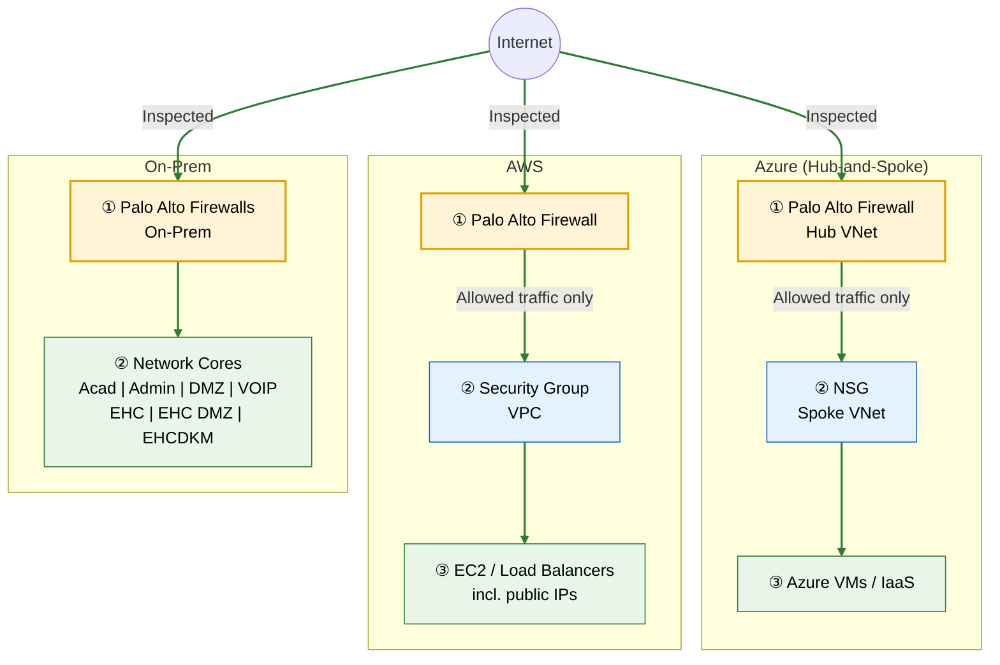
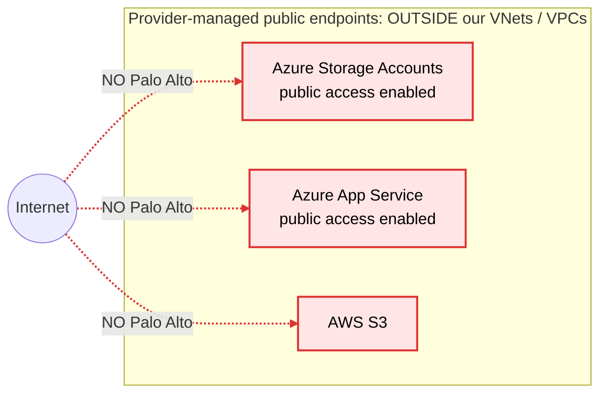

# Network Security Architecture – Firewall Traffic Flow (Azure / AWS / On-Prem)

> **Source:** Q&A with the Network Security team
> **Purpose:** Reference for how internet traffic reaches cloud workloads, where Palo Alto (PA) inspection applies, and where it does **not**.

---

## TL;DR

| # | Topic | Answer |
|---|-------|--------|
| 1 | On-prem or cloud firewall? | **Both.** On-prem PAs protect on-prem network cores. Separate cloud PAs protect Azure and AWS. Internet → Azure/AWS goes through the firewalls **in that cloud**. |
| 2 | Traffic path | `Internet → PA (cloud) → VNet/VPC → NSG/Security Group → Workload` ✅ Confirmed |
| 3 | Public IPs on EC2 / VMs / Load Balancers | **Always** pass through PA. Don't focus on public vs. private IP; the design guarantees inspection either way. |
| 4 | PaaS public endpoints (Azure Storage, App Service, S3) | **The exception.** Reached via Microsoft/AWS-owned public endpoints that **bypass PA**. Not part of the network security architecture. |

---

## Key Takeaways

| # | Takeaway | Why it matters |
|---|----------|----------------|
| 1 | **Two firewall domains:** on-prem PAs and cloud PAs are separate. | Know which team/ruleset owns a flow before troubleshooting or requesting access. |
| 2 | **IaaS is always inspected.** Internet traffic to VMs, EC2, and LB public IPs passes through PA. | Network-layer defense-in-depth: PA first, then NSG / Security Group. |
| 3 | **Default deny at the edge.** Inbound to Azure/AWS must be explicitly allowed on PA. | A new public workload isn't reachable until a PA rule is added. |
| 4 | **PaaS public endpoints bypass PA.** Storage, App Service, and S3 are not network-inspected. | PA gives zero protection here. This is the biggest exposure gap. |
| 5 | **For PaaS, security shifts to service + identity controls.** | Private Endpoints, disabled public access, RBAC/IAM, and Azure Policy / SCP guardrails replace the firewall. |
| 6 | **CSPM is the safety net for the PaaS gap.** | Alerts on publicly accessible storage/S3/App Service are high priority, especially in PHI/PII subscriptions. |
| 7 | **Azure VM public IP coverage still unconfirmed.** | The network team only explicitly confirmed EC2/LB. Verify before relying on it. |

---

## Q&A with Network Security Team

### Q1. Is the Palo Alto firewall we are using an on-prem firewall or a cloud firewall?
**My assumption:** It is a cloud firewall, since any traffic from the internet hitting our Azure VNets and AWS VPCs must go through PA first.

> **Answer:**
> - We have firewalls on-prem to control access to our on-prem network cores (Acad, Admin, DMZ, VOIP, EHC, EHC DMZ, EHCDKM, etc.).
> - We have firewalls in the cloud to protect our AWS and Azure network space.
> - Internet access to Azure/AWS goes through the firewalls in the respective clouds.

### Q2. Is this accurate? `Internet → PA cloud firewall → VNet/VPC → NSG/Security Group → cloud workloads`

> **Answer:** Yes, that is basically correct.

### Q3. Does Palo Alto also filter traffic going to an EC2 public IP or a virtual machine's public IP?
**My assumption:** Traffic won't touch Palo Alto unless the public IP is removed.

> **Answer:** I would not get hung up on public/private IP. There are different ways that this works, but in every situation, to get to an EC2 from the internet, you have to pass through a Palo Alto firewall.

### Q4. What if we have storage accounts or app services that allow public access from internet traffic? Is this traffic automatically going through the Palo Alto cloud firewall?
**My assumption:** No, because Azure Storage has a public endpoint and Palo Alto cannot inspect it.

> **Answer:** This is sort of the only exception. Things like S3 are not really part of our AWS network security architecture, because, like you said, access is via public IP that doesn't go through our firewall, nor do I know a way for it to go through our firewall.
>
> But don't confuse that with EC2 public IPs or load balancer public IPs. Access to those **ALWAYS** goes through the Palo Altos.

---

## 1. Firewall Placement

| Location | Protects | Notes |
|----------|----------|-------|
| **On-prem PA firewalls** | On-prem network cores | Acad, Admin, DMZ, VOIP, EHC, EHC DMZ, EHCDKM, etc. |
| **Azure PA firewalls** | Azure network space | Hub-and-spoke; PA sits in the hub between internet and spoke VNets |
| **AWS PA firewalls** | AWS network space | Inspects inbound internet traffic to VPCs |

**Rule:** Any inbound internet traffic into Azure or AWS network space must be **explicitly allowed** on the cloud PA.

---

## 2. Network Diagrams

Traffic is split into two diagrams so the paths don't get confused.

### Diagram A: Traffic that IS inspected by Palo Alto ✅

Everything **inside** our network space (VNets, VPCs, on-prem cores) is reached only through Palo Alto first. This includes VMs, EC2, and load balancers **with public IPs**.



### Diagram B: Traffic that is NOT inspected by Palo Alto ⚠️ (PaaS exception)

These services are **not** inside our VNets/VPCs. They're reached through Microsoft/AWS-owned public endpoints, so Palo Alto is never in the path.



| Diagram | Line style | Meaning |
|---------|-----------|---------|
| A | Solid green | Passes through Palo Alto first, then NSG / Security Group |
| B | Dashed red | Bypasses Palo Alto; protected only by service + identity controls (Section 4) |

---

## 3. Traffic Flow Details

### Inspected path (IaaS)
```
Internet → Palo Alto (cloud) → VNet / VPC → NSG / Security Group → Workload
```
Applies to:
- Azure VMs (including those with public IPs)
- AWS EC2 (including those with public IPs)
- Load balancer public IPs

### Uninspected path (PaaS public endpoints)
```
Internet → Provider-owned public endpoint → Service (no Palo Alto)
```
Applies to:
- Azure Storage Accounts with public network access enabled
- Azure App Service with public access enabled
- AWS S3

These services live outside customer VNets/VPCs, so there is no path to force their public traffic through PA.

---

## 4. Security Implications (PaaS Exception)

Because PA can't protect PaaS public endpoints, controls must live at the **service** and **identity** layer:

| Control | Azure | AWS |
|---------|-------|-----|
| Remove public exposure | Private Endpoints + `publicNetworkAccess = Disabled` | VPC Endpoints / bucket policy restricting `aws:SourceVpce` |
| Service-level firewall | Storage firewall / App Service access restrictions | Bucket policies, S3 Block Public Access |
| Identity | Entra ID auth, disable shared key access, RBAC | IAM least privilege |
| Preventive guardrails | Azure Policy (deny public network access) | SCPs, account-level Block Public Access |
| Detective | Falcon CSPM / Defender for Cloud | Falcon CSPM / Security Hub |

---

## 5. Open Questions for Network Team

| # | Question |
|---|----------|
| 1 | Q3 answer explicitly covered EC2 and LB public IPs. Confirm the same guarantee for **Azure VM public IPs**. |
| 2 | How is on-prem ↔ cloud traffic routed (ExpressRoute / VPN)? Does it pass through both on-prem and cloud PAs? |
| 3 | Is **egress** (cloud → internet) also forced through PA (e.g., UDR 0.0.0.0/0 to PA in Azure)? |
| 4 | Is east-west traffic (spoke ↔ spoke, VPC ↔ VPC) inspected by PA? |
